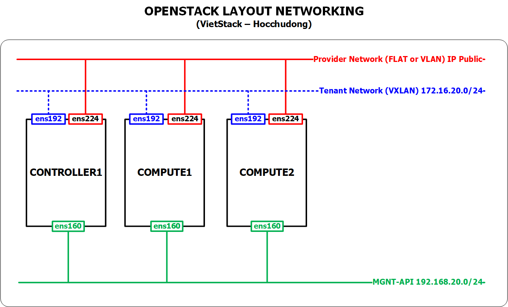
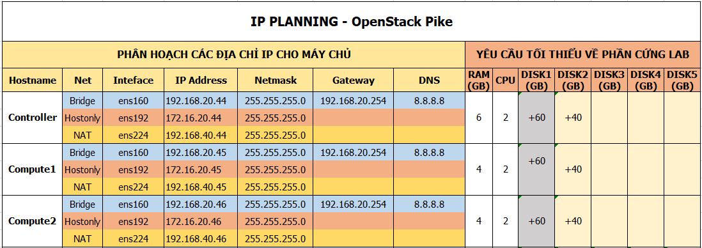

# Hương dẫn cài đặt OpenStack Mitaka bằng Packstack trên CENTOS 7.x


## 1. Các bước chuẩn bị
### 1.1. Giới thiệu

- Lưu ý: Trong tài liệu này chỉ thực hiện cài đặt OpenStack, bước cài đặt CEPH ở tài liệu khác.
- Packstack là một công cụ cài đặt OpenStack nhanh chóng.
- Packstack được phát triển bởi redhat
- Chỉ hỗ trợ các distro: RHEL, Centos
- Tự động hóa các bước cài đặt và lựa chọn thành phần cài đặt.
- Nhanh chóng dựng được môi trường OpenStack để sử dụng làm PoC nội bộ, demo khách hàng, test tính năng.
- Nhược điểm 1 : Đóng kín các bước cài đối với người mới.
- Nhược điểm 2: Khó bug các lỗi khi cài vì đã được đóng gói cùng với các tool cài đặt tự động (puppet)


### 1.2. Môi trường thực hiện 

- Sử dụng VMware Workstation để tạo các máy cài đặt OpenStack
- Distro: CentOS 7.x
- OpenStack Pike
- NIC1 - ens160: là dải mạng sử dụng cho các traffic MGNT + API + DATA VM. Dải mạng này sử dụng chế độ `bridge` trong VMware Workstation. Tùy vào IP máy thật của bạn thì địa chỉ sẽ khác nhau.
- NIC2 - ens224 : Là dải mạng mà các máy ảo sẽ giao tiếp với bên ngoài. Dải mạng này sử dụng chế độ NAT của VMware Workstation. Địa chỉ IP này phụ thuộc vào việc bạn setup IP cho card NAT trong VMware Workstation.
- NIC3 - ens192: Là dải mạng mà các máy ảo sẽ truyền thông với nhau (giữa máy ảo với máy ảo). Dải này sử dụng card mạng hostonly trong VMware Workstation.


### 1.3. Mô hình




### 1.4. IP Planning



- Lưu ý: 
  - Sử dụng đúng thứ tự các interface (NICs) của máy để cài đặt OpenStack.
  - Sử dụng đúng các dải địa chỉ IP.

## 2. Các bước cài đặt
### 2.1. Các bước chuẩn bị trên trên Controller

- Thiết lập hostname

	```sh
	hostnamectl set-hostname controller1
	```

- Thiết lập IP 
  ```sh
  echo "Setup IP  ens160"
  nmcli c modify ens160 ipv4.addresses 192.168.20.44/24
  nmcli c modify ens160 ipv4.gateway 192.168.20.254
  nmcli c modify ens160 ipv4.dns 8.8.8.8
  nmcli c modify ens160 ipv4.method manual
  nmcli con mod ens160 connection.autoconnect yes


  echo "Setup IP  ens192"
  nmcli c modify ens192 ipv4.addresses 172.16.20.44/24
  nmcli c modify ens192 ipv4.method manual
  nmcli con mod ens192 connection.autoconnect yes


  echo "Setup IP  ens224"
  nmcli c modify ens224 ipv4.addresses 192.168.40.44/24
  nmcli c modify ens224 ipv4.method manual
  nmcli con mod ens224 connection.autoconnect yes

  sudo systemctl disable firewalld
  sudo systemctl stop firewalld
  sudo systemctl disable NetworkManager
  sudo systemctl stop NetworkManager
  sudo systemctl enable network
  sudo systemctl start network

  sed -i 's/SELINUX=enforcing/SELINUX=disabled/g' /etc/sysconfig/selinux
  sed -i 's/SELINUX=enforcing/SELINUX=disabled/g' /etc/selinux/config
  ```
  
- Khai báo repos cho OpenStack Pike

   ```sh
  sudo yum install -y centos-release-openstack-pike
  yum update -y

  sudo yum install -y wget crudini fping
  yum install -y openstack-packstack

  yum install -y epel-release
  sudo yum install byobu 

  init 6 
    ```

### 2.2. Các bước chuẩn bị trên trên Compute1

- Thiết lập hostname

    ```sh
    hostnamectl set-hostname compute1
    ```

- Thiết lập IP 

  ```sh
  echo "Setup IP  ens160"
  nmcli c modify ens160 ipv4.addresses 192.168.20.45/24
  nmcli c modify ens160 ipv4.gateway 192.168.20.254
  nmcli c modify ens160 ipv4.dns 8.8.8.8
  nmcli c modify ens160 ipv4.method manual
  nmcli con mod ens160 connection.autoconnect yes


  echo "Setup IP  ens192"
  nmcli c modify ens192 ipv4.addresses 172.16.20.45/24
  nmcli c modify ens192 ipv4.method manual
  nmcli con mod ens192 connection.autoconnect yes


  echo "Setup IP  ens224"
  nmcli c modify ens224 ipv4.addresses 192.168.40.45/24
  nmcli c modify ens224 ipv4.method manual
  nmcli con mod ens224 connection.autoconnect yes

  sudo systemctl disable firewalld
  sudo systemctl stop firewalld
  sudo systemctl disable NetworkManager
  sudo systemctl stop NetworkManager
  sudo systemctl enable network
  sudo systemctl start network

  sed -i 's/SELINUX=enforcing/SELINUX=disabled/g' /etc/sysconfig/selinux
  sed -i 's/SELINUX=enforcing/SELINUX=disabled/g' /etc/selinux/config
  ```

- Khai báo repos cho OpenStack Pike trên node `Compute1`
  ```sh
  sudo yum install -y centos-release-openstack-pike
  yum update -y

  sudo yum install -y wget crudini fping
  yum install -y openstack-packstack

  yum install -y epel-release
  sudo yum install byobu 

  init 6 
  ```

### 2.3. Các bước chuẩn bị trên trên Compute2

- Thiết lập hostname
  ```sh
  hostnamectl set-hostname compute2
  ```

- Thiết lập IP 
  ```sh
  echo "Setup IP  ens160"
  nmcli c modify ens160 ipv4.addresses 192.168.20.46/24
  nmcli c modify ens160 ipv4.gateway 192.168.20.254
  nmcli c modify ens160 ipv4.dns 8.8.8.8
  nmcli c modify ens160 ipv4.method manual
  nmcli con mod ens160 connection.autoconnect yes


  echo "Setup IP  ens192"
  nmcli c modify ens192 ipv4.addresses 172.16.20.46/24
  nmcli c modify ens192 ipv4.method manual
  nmcli con mod ens192 connection.autoconnect yes


  echo "Setup IP  ens224"
  nmcli c modify ens224 ipv4.addresses 192.168.40.46/24
  nmcli c modify ens224 ipv4.method manual
  nmcli con mod ens224 connection.autoconnect yes

  sudo systemctl disable firewalld
  sudo systemctl stop firewalld
  sudo systemctl disable NetworkManager
  sudo systemctl stop NetworkManager
  sudo systemctl enable network
  sudo systemctl start network

  sed -i 's/SELINUX=enforcing/SELINUX=disabled/g' /etc/sysconfig/selinux
  sed -i 's/SELINUX=enforcing/SELINUX=disabled/g' /etc/selinux/config
  ```

- Khai báo repos cho OpenStack Pike trên node `Compute2`
  ```sh
  sudo yum install -y centos-release-openstack-pike
  yum update -y

  sudo yum install -y wget crudini fping
  yum install -y openstack-packstack

  yum install -y epel-release
  sudo yum install byobu 

  init 6 
  ```

    
### 2.4. Bắt đầu cài đặt `packstack` trên trên Controller

### THUC HIEN TREN CTL
#### Cai dat OpenStack bang packstack 

- Gõ lệnh dưới 
```sh
byobu
```

- Tạo file trả lời để cài packstack
  ```sh
  packstack packstack --gen-answer-file=/root/rdotraloi.txt \
      --allinone \
      --default-password=Welcome123 \
      --os-cinder-install=y \
      --os-ceilometer-install=y \
      --os-trove-install=n \
      --os-ironic-install=n \
      --nagios-install=n \
      --os-swift-install=n \
      --os-gnocchi-install=y \
      --os-aodh-install=y \
      --os-neutron-ovs-bridge-mappings=extnet:br-ex \
      --os-neutron-ovs-bridge-interfaces=br-ex:ens224 \
      --os-neutron-ovs-bridges-compute=br-ex \
      --os-neutron-ml2-type-drivers=vxlan,flat \
      --os-controller-host=192.168.20.44 \
      --os-compute-hosts=192.168.20.45,192.168.20.46 \
      --os-neutron-ovs-tunnel-if=ens192 \
      --provision-demo=n
  ```

- Thực thi file trả lời vừa tạo ở trên (nếu cần có thể mở ra để chỉnh lại các tham số cần thiết.

  ```sh
  packstack --answer-file rdotraloi.txt
  ```