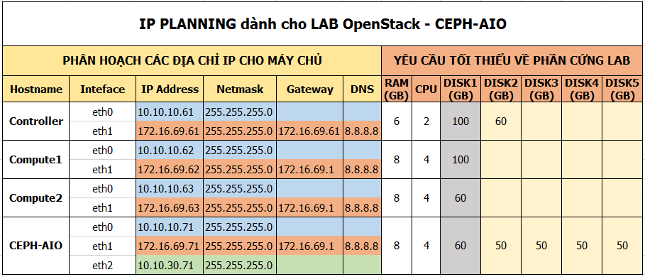
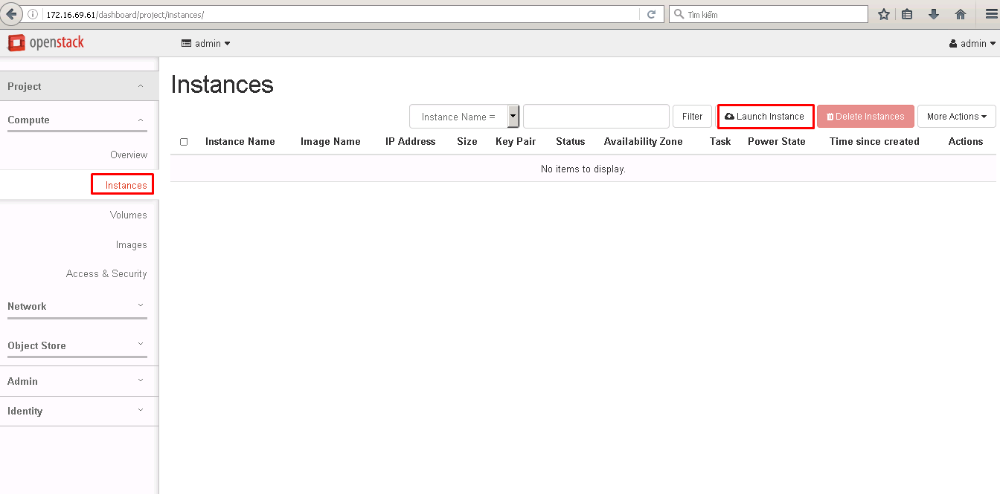
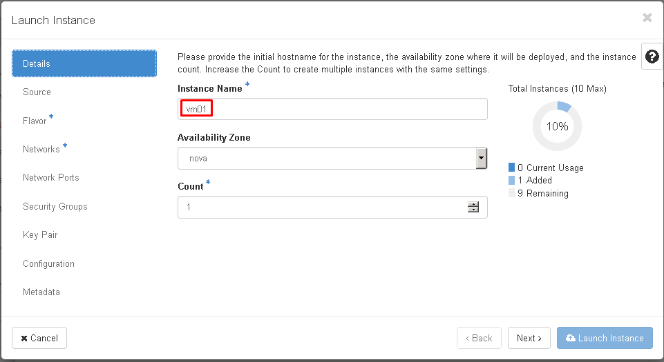
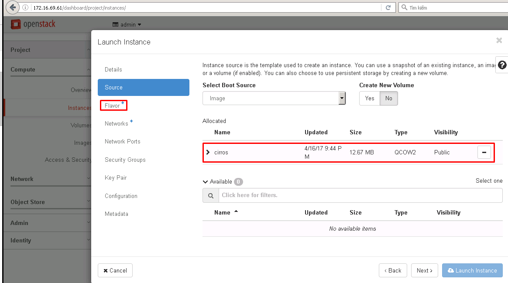
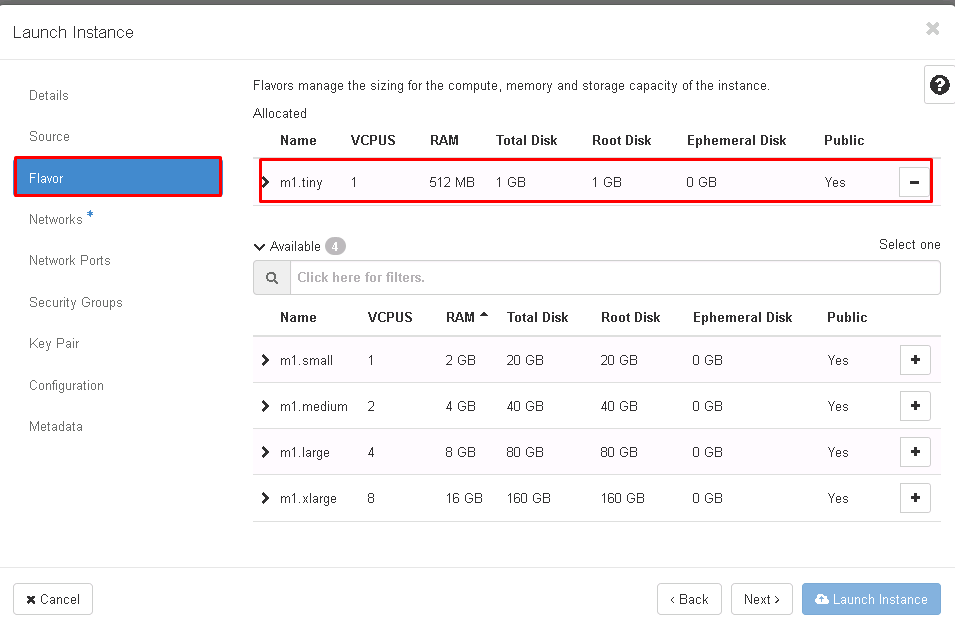
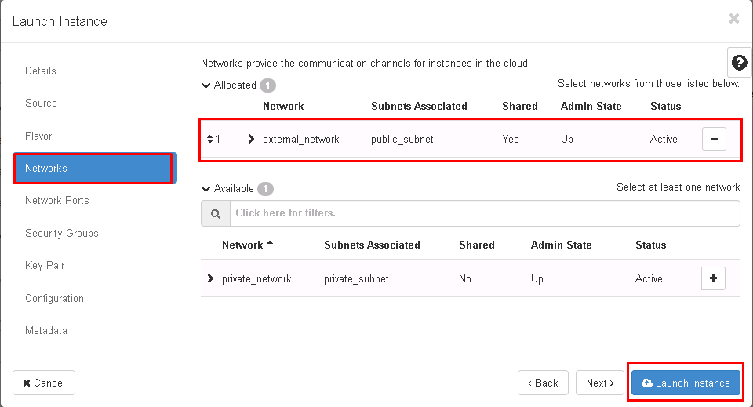

# Hương dẫn cài đặt OpenStack Mitaka bằng Packstack trên CENTOS 7.x


## 1. Các bước chuẩn bị
### 1.1. Giới thiệu

- Lưu ý: Trong tài liệu này chỉ thực hiện cài đặt OpenStack, bước cài đặt CEPH ở tài liệu khác.
- Packstack là một công cụ cài đặt OpenStack nhanh chóng.
- Packstack được phát triển bởi redhat
- Chỉ hỗ trợ các distro: RHEL, Centos
- Tự động hóa các bước cài đặt và lựa chọn thành phần cài đặt.
- Nhanh chóng dựng được môi trường OpenStack để sử dụng làm PoC nội bộ, demo khách hàng, test tính năng.
- Nhược điểm 1 : Đóng kín các bước cài đối với người mới.
- Nhược điểm 2: Khó bug các lỗi khi cài vì đã được đóng gói cùng với các tool cài đặt tự động (puppet)


### 1.2. Môi trường thực hiện 

- Sử dụng VMware Workstation để tạo các máy cài đặt OpenStack
- Distro: CentOS 7.x
- OpenStack Mitaka
- NIC1 - eno16777728: là dải mạng sử dụng cho các traffic MGNT + API + DATA VM. Dải mạng này sử dụng chế độ hostonly trong VMware Workstation
- NIC2 - eno33554952 : Là dải mạng mà các máy ảo sẽ giao tiếp với bên ngoài. Dải mạng này sử dụng chế độ bridge hoặc NAT của VMware Workstation


### 1.3. Mô hình


- Lưu ý: Khi dựng các máy chỉ cần dựng đủ các node cho OpenStack, máy CEPH được sử dụng ở tài liệu khác.

### 1.4. IP Planning



- Lưu ý: 
  - Khi dựng các máy chỉ cần dựng đủ các node cho OpenStack, máy CEPH được sử dụng ở tài liệu khác.
  - Sử dụng đúng thứ tự các interface (NICs) của máy để cài đặt OpenStack.
  - Sử dụng đúng các dải địa chỉ IP.

## 2. Các bước cài đặt
### 2.1. Các bước chuẩn bị trên trên Controller

- Thiết lập hostname

	```sh
	hostnamectl set-hostname controller
	```

- Thiết lập IP 
  ```sh
  echo "Setup IP  eno16777728"
  nmcli c modify eno16777728 ipv4.addresses 10.10.10.61/24
  nmcli c modify eno16777728 ipv4.method manual
  nmcli con mod eno16777728 connection.autoconnect yes

  echo "Setup IP  eno33554952"
  nmcli c modify eno33554952 ipv4.addresses 172.16.69.61/24
  nmcli c modify eno33554952 ipv4.gateway 172.16.69.1
  nmcli c modify eno33554952 ipv4.dns 8.8.8.8
  nmcli c modify eno33554952 ipv4.method manual
  nmcli con mod eno33554952 connection.autoconnect yes


  sudo systemctl disable firewalld
  sudo systemctl stop firewalld
  sudo systemctl disable NetworkManager
  sudo systemctl stop NetworkManager
  sudo systemctl enable network
  sudo systemctl start network

  sed -i 's/SELINUX=enforcing/SELINUX=disabled/g' /etc/sysconfig/selinux
  ```
  
- Khai báo repos cho OpenStack Mitaka

   ```sh
    sudo yum install -y centos-release-openstack-mitaka
    yum update -y

    sudo yum install -y wget crudini fping
    yum install -y openstack-packstack
    init 6
    ```


### 2.2. Các bước chuẩn bị trên trên Compute1

- Thiết lập hostname

    ```sh
    hostnamectl set-hostname compute1
    ```

- Thiết lập IP 

  ```sh
  echo "Setup IP  eno16777728"
  nmcli c modify eno16777728 ipv4.addresses 10.10.10.62/24
  nmcli c modify eno16777728 ipv4.method manual
  nmcli con mod eno16777728 connection.autoconnect yes

  echo "Setup IP  eno33554952"
  nmcli c modify eno33554952 ipv4.addresses 172.16.69.62/24
  nmcli c modify eno33554952 ipv4.gateway 172.16.69.1
  nmcli c modify eno33554952 ipv4.dns 8.8.8.8
  nmcli c modify eno33554952 ipv4.method manual
  nmcli con mod eno33554952 connection.autoconnect yes

  sudo systemctl disable firewalld
  sudo systemctl stop firewalld
  sudo systemctl disable NetworkManager
  sudo systemctl stop NetworkManager
  sudo systemctl enable network
  sudo systemctl start network

  sed -i 's/SELINUX=enforcing/SELINUX=disabled/g' /etc/sysconfig/selinux
  ```

- Khai báo repos cho OpenStack Mitaka
  ```sh
  sudo yum install -y centos-release-openstack-mitaka
  yum update -y

  sudo yum install -y wget crudini fping
  yum install -y openstack-packstack
  init 6
  ```

### 2.3. Các bước chuẩn bị trên trên Compute2

- Thiết lập hostname
  ```sh
  hostnamectl set-hostname compute2
  ```

- Thiết lập IP 
  ```sh
  echo "Setup IP  eno16777728"
  nmcli c modify eno16777728 ipv4.addresses 10.10.10.63/24
  nmcli c modify eno16777728 ipv4.method manual
  nmcli con mod eno16777728 connection.autoconnect yes

  echo "Setup IP  eno33554952"
  nmcli c modify eno33554952 ipv4.addresses 172.16.69.63/24
  nmcli c modify eno33554952 ipv4.gateway 172.16.69.1
  nmcli c modify eno33554952 ipv4.dns 8.8.8.8
  nmcli c modify eno33554952 ipv4.method manual
  nmcli con mod eno33554952 connection.autoconnect yes

  sudo systemctl disable firewalld
  sudo systemctl stop firewalld
  sudo systemctl disable NetworkManager
  sudo systemctl stop NetworkManager
  sudo systemctl enable network
  sudo systemctl start network

  sed -i 's/SELINUX=enforcing/SELINUX=disabled/g' /etc/sysconfig/selinux
  ```

- Khai báo repos cho OpenStack Mitaka
  ```sh
  sudo yum install -y centos-release-openstack-mitaka
  yum update -y

  sudo yum install -y wget crudini fping
  yum install -y openstack-packstack
  init 6
  ```

    
### 2.4. Bắt đầu cài đặt `packstack` trên trên Controller

- Login vào máy chủ Controler và thực hiện các bước dưới bằng  quyền root.
- Thực hiện lệnh `fping` từ máy `controller` để kiểm tra các IP trên các máy đã thiết lập đúng hay chưa.
  ```sh
  fping 10.10.10.61 10.10.10.62 10.10.10.63
  ```
  - Nếu kết quả KHÔNG như bên dưới thì cần kiểm tra lại các card mạng và bước thiết lập IP trên từng node.
    ```sh
    [root@controller ~]# fping 10.10.10.61 10.10.10.62 10.10.10.63
    10.10.10.61 is alive
    10.10.10.62 is alive
    10.10.10.63 is alive
    ```
- 

- Trong hướng dẫn này sẽ thực hiện cài đặt đồng thời 2 usecase về network của OpenStack, đó là `Provider network` và `Self service network`. Có nghĩa là máy ảo có thể gắn vào dải `provider` hoặc `selfservice`
- SSH vào máy chủ Controller và thực hiện bằng quyền `root`
- Sử dụng lệnh dưới để cài OpenStack.
- Khi cài, màn hình sẽ yêu cầu nhập mật khẩu của các máy COM1 và COM2, sau đó `packstack` sẽ tự động cài trên các máy này mà ko cần thao tác.
  ```sh
  packstack --allinone \
      --default-password=Welcome123 \
      --os-cinder-install=y \
      --os-ceilometer-install=y \
      --os-trove-install=n \
      --os-ironic-install=n \
      --nagios-install=n \
      --os-swift-install=y \
      --os-gnocchi-install=y \
      --os-aodh-install=y \
      --os-neutron-ovs-bridge-mappings=extnet:br-ex \
      --os-neutron-ovs-bridge-interfaces=br-ex:eno33554952 \
      --os-neutron-ovs-bridges-compute=br-ex \
      --os-neutron-ml2-type-drivers=vxlan,flat \
      --os-controller-host=172.16.69.61 \
      --os-compute-hosts=172.16.69.62,172.16.69.63 \
      --os-neutron-ovs-tunnel-if=eno16777728 \
      --provision-demo=n
  ```

- Sau khi cài đặt hoàn tất, trên màn hình sẽ xuất hiên thông báo về các kết quả cài đặt cùng với link truy cập và các tài khoản. 
  ```sh
   **** Installation completed successfully ******

  Additional information:
   * A new answerfile was created in: /root/packstack-answers-20170417-025733.txt
   * Time synchronization installation was skipped. Please note that unsynchronized time on server instances might be problem for some OpenStack components.
   * File /root/keystonerc_admin has been created on OpenStack client host 172.16.69.61. To use the command line tools you need to source the file.
   * To access the OpenStack Dashboard browse to http://172.16.69.61/dashboard .
  Please, find your login credentials stored in the keystonerc_admin in your home directory.
   * The installation log file is available at: /var/tmp/packstack/20170417-025732-fagnK0/openstack-setup.log
   * The generated manifests are available at: /var/tmp/packstack/20170417-025732-fagnK0/manifests
  ```

- Truy cập vào web theo địa chỉ `http://172.16.69.61/dashboard`, tài khoản là `admin`, mật khẩu là `Welcome123`
  
## 3. Sử dụng OpenStack sau khi cài đặt xong.

- Thực hiện lệnh dưới để khai báo biến môi trường mỗi khi đăng nhập phiên mới vào máy chủ.

	```
	source /root/keystonerc_admin
	```
- Kiểm tra trạng thái của các service NOVA bằng lệnh `openstack compute service list`, nếu state là `up` thì có thể tiếp tục các bước dưới.
  ```sh
  [root@controller ~(keystone_admin)]# openstack compute service list
  +----+------------------+------------+----------+---------+-------+----------------------------+
  | Id | Binary           | Host       | Zone     | Status  | State | Updated At                 |
  +----+------------------+------------+----------+---------+-------+----------------------------+
  |  4 | nova-cert        | controller | internal | enabled | up    | 2017-04-16T22:35:35.000000 |
  |  5 | nova-consoleauth | controller | internal | enabled | up    | 2017-04-16T22:35:34.000000 |
  |  6 | nova-scheduler   | controller | internal | enabled | up    | 2017-04-16T22:35:35.000000 |
  |  7 | nova-conductor   | controller | internal | enabled | up    | 2017-04-16T22:35:35.000000 |
  |  8 | nova-compute     | compute1   | nova     | enabled | up    | 2017-04-16T22:35:37.000000 |
  |  9 | nova-compute     | compute2   | nova     | enabled | up    | 2017-04-16T22:35:43.000000 |
  +----+------------------+------------+----------+---------+-------+----------------------------+
  [root@controller ~(keystone_admin)]#
  ```

- Kiểm tra trạng thái của dịch vụ neutron bằng lệnh `neutron agent-list`, nếu có biểu tượng `:)` thì có thể tiếp tục bước dưới.
  ```sh
  [root@controller ~(keystone_admin)]# neutron agent-list
  +--------------------------------------+--------------------+------------+-------------------+-------+----------------+---------------------------+
  | id                                   | agent_type         | host       | availability_zone | alive | admin_state_up | binary                    |
  +--------------------------------------+--------------------+------------+-------------------+-------+----------------+---------------------------+
  | 28e6efd3-a651-4c3c-b199-609cd73e61c3 | Metadata agent     | controller |                   | :-)   | True           | neutron-metadata-agent    |
  | 5c39037b-a7c6-4130-b809-aa104939dd8a | DHCP agent         | controller | nova              | :-)   | True           | neutron-dhcp-agent        |
  | 60d6bb80-4869-4d09-9a95-15b931234009 | Open vSwitch agent | controller |                   | :-)   | True           | neutron-openvswitch-agent |
  | 80adc548-ef48-4c94-b41b-970ea0cd90e0 | L3 agent           | controller | nova              | :-)   | True           | neutron-l3-agent          |
  | 9b83dbb9-00a9-44f6-b482-842f3ff48490 | Open vSwitch agent | compute2   |                   | :-)   | True           | neutron-openvswitch-agent |
  | dd40b429-121d-4130-9801-6cb84960df49 | Open vSwitch agent | compute1   |                   | :-)   | True           | neutron-openvswitch-agent |
  | dee2b98c-e48c-43df-ac61-978c59511372 | Metering agent     | controller |                   | :-)   | True           | neutron-metering-agent    |
  +--------------------------------------+--------------------+------------+-------------------+-------+----------------+---------------------------+
  [root@controller ~(keystone_admin)]#
  ```

### 3.1. Upload image
- Thực thi biến môi trường
  ```sh
  source ~/keystonerc_admin
  ```

- Upload images
  ```sh
  curl http://download.cirros-cloud.net/0.3.4/cirros-0.3.4-x86_64-disk.img | glance \
  image-create --name='cirros' \
  --visibility=public \
  --container-format=bare \
  --disk-format=qcow2
  ```

###  3.2. Tạo network, router
- Tạo network public 
  ```sh
  neutron net-create external_network --provider:network_type flat \
  --provider:physical_network extnet  \
  --router:external \
  --shared
  ```

- Tạo subnet trong network public 
  ```sh
  neutron subnet-create --name public_subnet \
  --enable_dhcp=True --dns-nameserver 8.8.8.8\
  --allocation-pool=start=172.16.69.80,end=172.16.69.100 \
  --gateway=172.16.69.1 external_network 172.16.69.0/24
  ```

- Tạo network private
  ```sh
  neutron net-create private_network
  neutron subnet-create --name private_subnet private_network 10.0.0.0/24 \
  --dns-nameserver 8.8.8.8
  ```

- Tạo router tên là `Vrouter` và add các network vừa tạo ở trên vào router.

  ```sh
  neutron router-create Vrouter
  neutron router-gateway-set Vrouter external_network
  neutron router-interface-add Vrouter private_subnet
  ```

- Kiểm tra IP của router vừa được gán interface
  ```sh
  [root@controller ~(keystone_admin)]# neutron router-port-list Vrouter
  +--------------------------------------+------+-------------------+-------------------------------------------------------------------------------------+
  | id                                   | name | mac_address       | fixed_ips                                                                           |
  +--------------------------------------+------+-------------------+-------------------------------------------------------------------------------------+
  | 6e55b512-597a-40e6-840b-6fb09b0bf206 |      | fa:16:3e:28:1e:8d | {"subnet_id": "63444746-8027-4929-b1b6-cff63faf3cbd", "ip_address": "10.0.0.1"}     |
  | 97067c33-a250-4daf-a8d9-4a4238e31395 |      | fa:16:3e:5a:69:60 | {"subnet_id": "4901d8ac-95f2-4791-9331-bd905dc82640", "ip_address": "172.16.69.81"} |
  +--------------------------------------+------+-------------------+-------------------------------------------------------------------------------------+
  [root@controller ~(keystone_admin)]#
  ```
  - Ping tới ip của dải provider để kiểm tra xem đã gán được interface hay chưa
    ```sh
    [root@controller ~(keystone_admin)]# ping 172.16.69.81
    PING 172.16.69.81 (172.16.69.81) 56(84) bytes of data.
    64 bytes from 172.16.69.81: icmp_seq=1 ttl=64 time=1.44 ms
    64 bytes from 172.16.69.81: icmp_seq=2 ttl=64 time=0.095 ms
    ```
  
- Mở các rule cần thiết cho máy ảo (trong thực tế nên mở các rule cần thiết, tránh mở tất cả các port như hướng dẫn này)
  ```sh
  openstack security group rule create --proto icmp default
  openstack security group rule create --proto tcp --dst-port 1:65535 default
  openstack security group rule create --proto udp --dst-port 1:65535 default
  ```
  
- Truy cập vào web để tạo máy ảo.

## 4. Sử dụng dashboad
### 4.1. Tạo máy ảo

- Đăng nhập vào dashboad và thưc hiện theo bước sau
- Click vào tab `Instances` và chọn `Launch Instance`


- Trong tab `Details`, nhập tên máy ảo



- Trong tab `Source` chọn images cho máy ảo


- Trong tab `Flavor` chọn kích thước của máy ảo 


- Trong tab `Network` chọn dải mạng mà máy ảo sẽ gắn vào. Trong ví dụ này chọn dải external, nếu chọn dải private thì cần thực hiện bước floating IP.


- Chờ máy máy khởi tạo và thưc hiện ping, ssh để kiểm tra với IP được cấp trên dashboad
