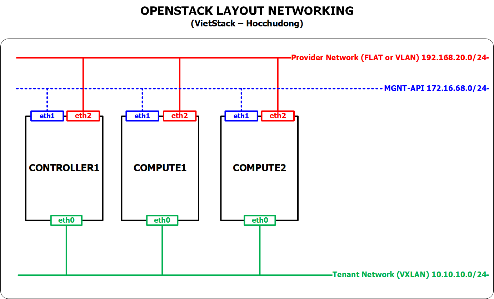

# Hương dẫn cài đặt OpenStack Queens bằng Packstack trên CENTOS 7.x


## 1. Các bước chuẩn bị
### 1.1. Giới thiệu

- Lưu ý: Trong tài liệu này chỉ thực hiện cài đặt OpenStack, bước cài đặt CEPH ở tài liệu khác.
- Packstack là một công cụ cài đặt OpenStack nhanh chóng.
- Packstack được phát triển bởi redhat
- Chỉ hỗ trợ các distro: RHEL, Centos
- Tự động hóa các bước cài đặt và lựa chọn thành phần cài đặt.
- Nhanh chóng dựng được môi trường OpenStack để sử dụng làm PoC nội bộ, demo khách hàng, test tính năng.
- Nhược điểm 1 : Đóng kín các bước cài đối với người mới.
- Nhược điểm 2: Khó bug các lỗi khi cài vì đã được đóng gói cùng với các tool cài đặt tự động (puppet)


### 1.2. Môi trường thực hiện 

- Sử dụng VMware Workstation để tạo các máy cài đặt OpenStack
- Distro: CentOS 7.x
- OpenStack Queens
- Sử dụng 03 NICs đối với các máy: Controller1, Compute1, Compute2
  - NIC1 - ens160: là dải mạng sử dụng cho các traffic MGNT + API + DATA VM. Dải mạng này sử dụng chế độ `bridge` trong VMware Workstation. Tùy vào IP máy thật của bạn thì địa chỉ sẽ khác nhau.
  - NIC2 - ens224 : Là dải mạng mà các máy ảo sẽ giao tiếp với bên ngoài. Dải mạng này sử dụng chế độ NAT của VMware Workstation. Địa chỉ IP này phụ thuộc vào việc bạn setup IP cho card NAT trong VMware Workstation.
  - NIC3 - ens192: Là dải mạng mà các máy ảo sẽ truyền thông với nhau (giữa máy ảo với máy ảo). Dải này sử dụng card mạng hostonly trong VMware Workstation.


### 1.3. Mô hình




### 1.4. IP Planning


- Lưu ý: 
  - Sử dụng đúng thứ tự các interface (NICs) của máy để cài đặt OpenStack.
  - Sử dụng đúng các dải địa chỉ IP.

## 2. Các bước cài đặt
### 2.1. Các bước chuẩn bị trên trên Controller

- Thiết lập hostname

	```sh
	hostnamectl set-hostname controller1
	```

- Thiết lập IP 
  ```sh
  echo "Setup IP  eth0"
  nmcli c modify eth0 ipv4.addresses 10.10.10.201/24
  nmcli c modify eth0 ipv4.method manual
  nmcli con mod eth0 connection.autoconnect yes

  echo "Setup IP  eth1"
  nmcli c modify eth1 ipv4.addresses 172.16.68.201/24
  nmcli c modify eth1 ipv4.gateway 172.16.68.1
  nmcli c modify eth1 ipv4.dns 8.8.8.8
  nmcli c modify eth1 ipv4.method manual
  nmcli con mod eth1 connection.autoconnect yes

  echo "Setup IP  eth2"
  nmcli c modify eth2 ipv4.addresses 192.168.20.201/24
  nmcli c modify eth2 ipv4.method manual
  nmcli con mod eth2 connection.autoconnect yes

  sudo systemctl disable firewalld
  sudo systemctl stop firewalld
  sudo systemctl disable NetworkManager
  sudo systemctl stop NetworkManager
  sudo systemctl enable network
  sudo systemctl start network

  sed -i 's/SELINUX=enforcing/SELINUX=disabled/g' /etc/sysconfig/selinux
  sed -i 's/SELINUX=enforcing/SELINUX=disabled/g' /etc/selinux/config
  ```
  
- Khai báo repos cho OpenStack Queens

  ```sh
  yum install -y python-setuptools
  sudo yum install -y centos-release-openstack-queens
  yum update -y

  sudo yum install -y wget crudini fping
  yum install -y openstack-packstack

  yum install -y epel-release
  sudo yum install -y byobu 
  ```

- Trong queens khi sử dụng packstack để cài có thể gặp lỗi `ERROR : Failed to load plugin from file ssl_001.py`, fix theo hướng dẫn dưới (trong đoạn trên đã cài sẵn các fix rồi nhé)
```sh
https://gist.github.com/congto/36116ef868ee8fe2b2e83249710fee16
```

### 2.2. Các bước chuẩn bị trên trên Compute1

- Thiết lập hostname

    ```sh
    hostnamectl set-hostname compute1
    ```

- Thiết lập IP 

  ```sh
  echo "Setup IP  eth0"
  nmcli c modify eth0 ipv4.addresses 10.10.10.202/24
  nmcli c modify eth0 ipv4.method manual
  nmcli con mod eth0 connection.autoconnect yes

  echo "Setup IP  eth1"
  nmcli c modify eth1 ipv4.addresses 172.16.68.202/24
  nmcli c modify eth1 ipv4.gateway 172.16.68.1
  nmcli c modify eth1 ipv4.dns 8.8.8.8
  nmcli c modify eth1 ipv4.method manual
  nmcli con mod eth1 connection.autoconnect yes

  echo "Setup IP  eth2"
  nmcli c modify eth2 ipv4.addresses 192.168.20.202/24
  nmcli c modify eth2 ipv4.method manual
  nmcli con mod eth2 connection.autoconnect yes

  sudo systemctl disable firewalld
  sudo systemctl stop firewalld
  sudo systemctl disable NetworkManager
  sudo systemctl stop NetworkManager
  sudo systemctl enable network
  sudo systemctl start network

  sed -i 's/SELINUX=enforcing/SELINUX=disabled/g' /etc/sysconfig/selinux
  sed -i 's/SELINUX=enforcing/SELINUX=disabled/g' /etc/selinux/config
  ```

- Khai báo repos cho OpenStack Queens trên node `Compute1`

  ```sh
  yum install -y python-setuptools
  sudo yum install -y centos-release-openstack-queens
  yum update -y

  sudo yum install -y wget crudini fping
  yum install -y openstack-packstack

  yum install -y epel-release
  sudo yum install -y byobu 
  ```
  
- Trong queens khi sử dụng packstack để cài có thể gặp lỗi `ERROR : Failed to load plugin from file ssl_001.py`, fix theo hướng dẫn dưới (trong đoạn trên đã cài sẵn các fix rồi nhé)
```sh
https://gist.github.com/congto/36116ef868ee8fe2b2e83249710fee16
```

### 2.3. Các bước chuẩn bị trên trên Compute2

- Thiết lập hostname
  ```sh
  hostnamectl set-hostname compute2
  ```

- Thiết lập IP 
  ```sh
  echo "Setup IP  eth0"
  nmcli c modify eth0 ipv4.addresses 10.10.10.203/24
  nmcli c modify eth0 ipv4.method manual
  nmcli con mod eth0 connection.autoconnect yes

  echo "Setup IP  eth1"
  nmcli c modify eth1 ipv4.addresses 172.16.68.203/24
  nmcli c modify eth1 ipv4.gateway 172.16.68.1
  nmcli c modify eth1 ipv4.dns 8.8.8.8
  nmcli c modify eth1 ipv4.method manual
  nmcli con mod eth1 connection.autoconnect yes

  echo "Setup IP  eth2"
  nmcli c modify eth2 ipv4.addresses 192.168.20.203/24
  nmcli c modify eth2 ipv4.method manual
  nmcli con mod eth2 connection.autoconnect yes

  sudo systemctl disable firewalld
  sudo systemctl stop firewalld
  sudo systemctl disable NetworkManager
  sudo systemctl stop NetworkManager
  sudo systemctl enable network
  sudo systemctl start network

  sed -i 's/SELINUX=enforcing/SELINUX=disabled/g' /etc/sysconfig/selinux
  sed -i 's/SELINUX=enforcing/SELINUX=disabled/g' /etc/selinux/config
  ```

- Khai báo repos cho OpenStack Queens trên node `Compute2`

  ```sh
  yum install -y python-setuptools
  sudo yum install -y centos-release-openstack-queens
  yum update -y

  sudo yum install -y wget crudini fping
  yum install -y openstack-packstack

  yum install -y epel-release
  sudo yum install -y byobu 
  ```

- Trong queens khi sử dụng packstack để cài có thể gặp lỗi `ERROR : Failed to load plugin from file ssl_001.py`, fix theo hướng dẫn dưới (trong đoạn trên đã cài sẵn các fix rồi nhé)
```sh
https://gist.github.com/congto/36116ef868ee8fe2b2e83249710fee16
```

### 3. Cài đặt OpenStack Queens
#### 3.1. Chuẩn bị file trả lời cho packstack
- Đứng trên controller để thực hiện các bước sau
- Gõ lệnh dưới 
  ```sh
  byobu
  ```

- Tạo file trả lời để cài packstack
  ```sh
  packstack packstack --gen-answer-file=/root/rdotraloi.txt \
      --allinone \
      --default-password=Welcome123 \
      --os-cinder-install=y \
      --os-ceilometer-install=y \
      --os-trove-install=n \
      --os-ironic-install=n \
      --os-swift-install=n \
      --os-panko-install=y \
      --os-heat-install=y \
      --os-magnum-install=n \
      --os-aodh-install=y \
      --os-neutron-ovs-bridge-mappings=extnet:br-ex \
      --os-neutron-ovs-bridge-interfaces=br-ex:eth2 \
      --os-neutron-ovs-bridges-compute=br-ex \
      --os-neutron-ml2-type-drivers=vxlan,flat \
      --os-controller-host=172.16.68.201 \
      --os-compute-hosts=172.16.68.202,172.16.68.203 \
      --os-neutron-ovs-tunnel-if=eth0 \
      --provision-demo=n
  ```


  

- Thực thi file trả lời vừa tạo ở trên (nếu cần có thể mở ra để chỉnh lại các tham số cần thiết.

  ```sh
  packstack --answer-file rdotraloi.txt
  ```
  
- Nhập mật khẩu đăng nhập ssh của tài khoản root khi được yêu cầu.

- Chờ để packstack cài đặt xong.

####  3.2. Kiểm tra hoạt động của OpenStack sau khi cài 

- Sau khi cài đặt xong, màn hình sẽ hiển thị thông báo như dưới

  ```sh
   **** Installation completed successfully ******

  Additional information:
   * Time synchronization installation was skipped. Please note that unsynchronized time on server instances might be problem for some OpenStack components.
   * File /root/keystonerc_admin has been created on OpenStack client host 172.16.68.201. To use the command line tools you need to source the file.
   * To access the OpenStack Dashboard browse to http://172.16.68.201/dashboard .
  Please, find your login credentials stored in the keystonerc_admin in your home directory.
   * Because of the kernel update the host 172.16.68.202 requires reboot.
   * Because of the kernel update the host 172.16.68.203 requires reboot.
   * The installation log file is available at: /var/tmp/packstack/20180309-001110-LD0XmO/openstack-setup.log
   * The generated manifests are available at: /var/tmp/packstack/20180309-001110-LD0XmO/manifests
  ```

- Đứng trên `Controller1` thực hiện lệnh dưới để sửa các cấu hình cần thiết.

  ```sh
  sed -i -e 's/enable_isolated_metadata=False/enable_isolated_metadata=True/g' /etc/neutron/dhcp_agent.ini
  
  ssh -o StrictHostKeyChecking=no root@172.16.68.202 "sed -i -e 's/compute1/172.16.68.202/g' /etc/nova/nova.conf"
  
  ssh -o StrictHostKeyChecking=no root@172.16.68.203 "sed -i -e 's/compute2/172.16.68.203/g' /etc/nova/nova.conf"
  ```

- Tắt Iptables trên cả 03 node 

  ```sh 
  systemctl stop iptables
  systemctl disable iptables

  ssh -o StrictHostKeyChecking=no root@172.16.68.202 "systemctl stop iptables"
  ssh -o StrictHostKeyChecking=no root@172.16.68.202 "systemctl disable iptables"

  ssh -o StrictHostKeyChecking=no root@172.16.68.203 "systemctl stop iptables"
  ssh -o StrictHostKeyChecking=no root@172.16.68.203 "systemctl disable iptables"
  ```

    
  
- Khởi động lại cả 03 node `Controller1, Compute1, Compute2`.

  ```sh
  ssh -o StrictHostKeyChecking=no root@172.16.68.202 "init 6"
  
  ssh -o StrictHostKeyChecking=no root@172.16.68.203 "init 6"
  
  init 6
  ```

- Đăng nhập lại vào `Controller1` bằng quyền `root` và kiểm tra hoạt động của openstack sau khi cài.
  - Khai báo biến môi trường
    ```sh
    source keystonerc_admin
    ```
  
  - Kiểm tra hoạt động của openstack bằng lệnh dưới (`lưu ý: có thể phải mất vài phút để các service của OpenStack khởi động xong`).
    ```sh
    openstack token issue
    ```
    
  - Kết quả lệnh trên như sau:
    ```sh
    +------------+-----------------------------------------------------------------------------------------------------------------------------------------------------------------------------------------+
    | Field      | Value                                                                                                                                                                                   |
    +------------+-----------------------------------------------------------------------------------------------------------------------------------------------------------------------------------------+
    | expires    | 2017-09-17T14:46:54+0000                                                                                                                                                                |
    | id         | gAAAAABZvnzOyW6-0gJLN5_ZG5zRpj932wYO5EgfvTWdJzU6HYxI1UpAl5_EHvSpU4pA5KWWHzVQkmKBKx0Pex8ZVxcSdBZGCDiJYrNCOd--0fqi80MBQzQuAH7ODATgR2-ZM7Or41Rq1M4dwC1rTLLWoqtiHuY2qJus9OUapJwbDfAivWHYCAk |
    | project_id | 2f8619d1fea2465cbe302eb74ed10d2e                                                                                                                                                        |
    | user_id    | 4487225f20454467bf89e21c1a04e921                                                                                                                                                        |
    +------------+-----------------------------------------------------------------------------------------------------------------------------------------------------------------------------------------+
    ```

- Ngoài ra có thể kiểm tra thêm bằng cách lệnh khác: `openstack user list` ,  `openstack service list`, `openstack catalog list`

### 4. Tạo images, network, subnet, router, mở security group và tạo VM.
- Bước này có thể tạo bằng GUI hoặc bằng CLI
- Link truy cập vào web GUI là: 192.168.20.44. Đăng nhập với tài khoản là `admin`, mật khẩu là `Welcome123`

#### 4.1. Tạo images
- Đăng nhập vào node controller1 với quyền root và thực thi các lệnh sau
- Tải images cirros. Images này dùng để tạo các máy ảo sau này: 

  ```sh
  wget http://download.cirros-cloud.net/0.3.5/cirros-0.3.5-x86_64-disk.img
  ```

- Tạo images 

  ```sh
  source keystonerc_admin

  openstack image create "cirros" \
    --file cirros-0.3.5-x86_64-disk.img \
    --disk-format qcow2 --container-format bare \
    --public
  ```

- Kiểm tra việc tạo images, kết quả như dưới là thành công. Nếu không có kết quả này thì chịu khó làm lại hoặc đọc log :) 

  ```sh
  openstack image list
  ```


